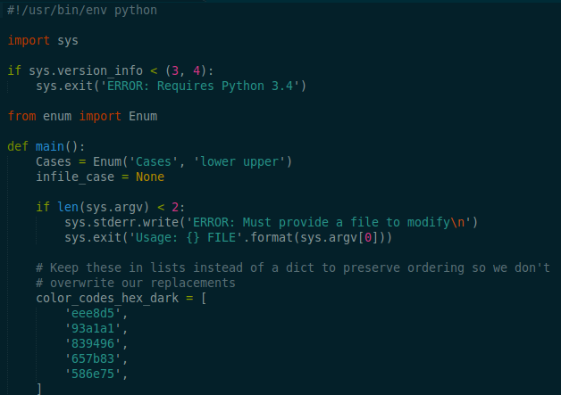
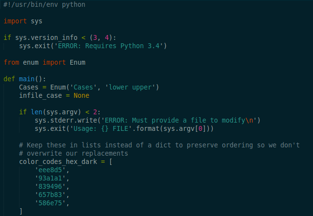

# solarized-dark-high-contrast
Various config files for the [Solarized](https://ethanschoonover.com/solarized/) dark high contrast color scheme

The official Solarized color scheme provides for various contrasts by shifting certain values up or down. I prefer the dark high contrast theme as it provides enough additional contrast to reduce eye strain. For more information see here:
https://github.com/altercation/vim-colors-solarized/blob/master/colors/solarized.vim#L399-L405

In most cases, the difference is incredibly subtle (which is a good thing).
 - Dark normal contrast:  
 
 - Dark high contrast:  
 

You may be able to convert a normal Solarized dark color scheme file to high contrast by using the provided Python script:

```
python solarized-dark-high-contrast.py solarized-dark-theme-file > solarized-dark-high-contrast
```
